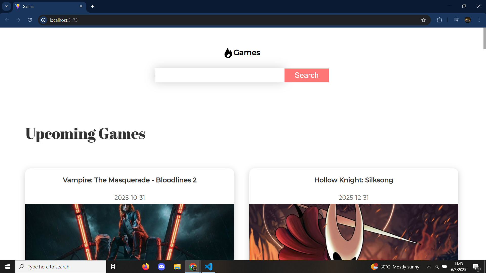

The Games Explorer is a responsive web app built with React, JavaScript, Redux, and Vite, using the RAWG Video
Games API to fetch real-time data on popular, upcoming, and newly released games. It features animated transitions
with Framer Motion, styled components for modular design, and a powerful search function for exploring detailed
game info, including ratings, platforms, and screenshots.

## 📸 Screenshots

### Main page

### Game search

### Game details

### Games extra photos

